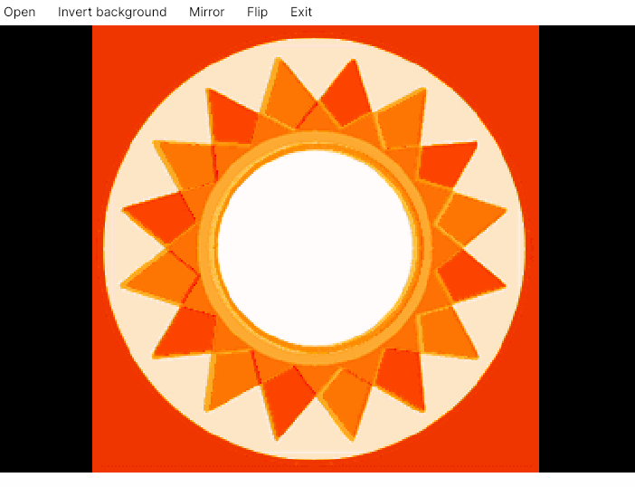

# TM2 view

Allows you to view TIM2 files, which is a texture format used by many PS2 games.

Supported formats:
* TIM2
* PlayStation 2 save icon texture data (uncompressed and RLE compressed)

Features:
* Multi-platform
* Flip/mirror images
* Nearest neighbor scaling
* Invert background
* Alpha channel support